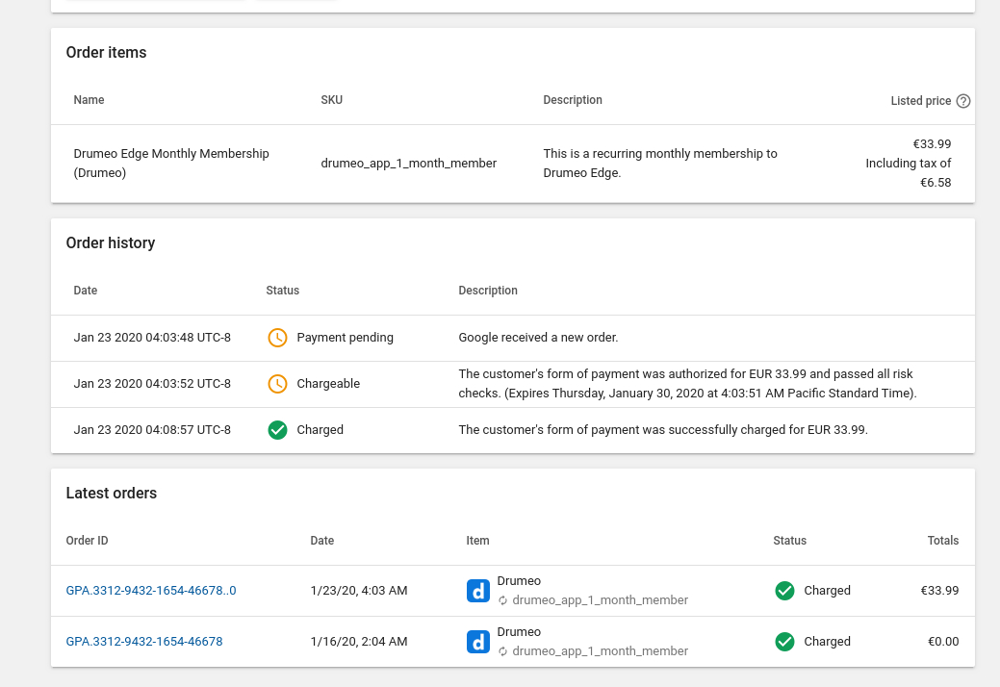

- A purchase token basically represents a users right to access content over time. It is the subscription itself.
- An order ID represents a payment attempt. Every payment for a purchase token (subscription) will have an associated order ID.
- The order IDs for a given purchase token look very similar. They are the same except for each additional renewal payment, an increment number is added to the end of the order ID. For example:

```
'To help you track transactions relating to a given subscription, 
Google payments provides a base Merchant Order Number for all recurrences 
of the subscription and denotes each recurring transaction 
by appending an integer as follows:' - Google

GPA.1234-5678-9012-34567 (base order number)
GPA.1234-5678-9012-34567..0 (first renewal orderID)
GPA.1234-5678-9012-34567..1 (second renewal orderID)
GPA.1234-5678-9012-34567..2 (third renewal orderID) ...
```

- In our system a unique google play order ID is represented by a payment. 
- A google order ID can have different payment statuses. When an order ID is created, it does not mean the payment has actually been processed.
- Google orders typically have 3 main phases. When its first created the payment status is pending. Once the payment has been authorized on the customers payment method, the payment state is chargeable. Once the payment has actually been charged successfully the state will be charged. This is the state in the google play console order management. NOT the paymentState attribute in Purchases.subscriptions API.



- There is no way to pull historical order IDs or statuses via the API.
- When requesting the purchase receipt data, the orderId will always be set to the latest payment.

API reference: [https://developers.google.com/android-publisher/api-ref/purchases/subscriptions](https://developers.google.com/android-publisher/api-ref/purchases/subscriptions)